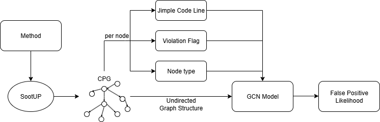

# False Positive Detection

The following two sections contain the training and usage/integration of the False-Positive detection model.

---

## Training

The training process begins with generating a **Code Property Graph (CPG)** for each vulnerable Java code snippet using **SootUp**.

Once the CPG is created, two additional node attributes are added:
- **Violation (boolean):** Set to `1` for the node corresponding to the violation line, and `0` otherwise.
- **False Positive (boolean):** Set to `1` for the corresponding violation line if it is considered a false positive.

To correctly identify and mark these nodes, a dummy code line is inserted before the affected line. This allows the system to detect the violation after the CPG creation, since the `label` attribute of each node stores code in its **Jimple** representation.

Additionally, each node is assigned a **node type** from the following categories:

- `AggregateGraphNode`
- `ExprGraphNode`
- `ImmediateGraphNode`
- `MethodGraphNode`
- `ModifierGraphNode`
- `PropertyGraphNode`
- `RefGraphNode`
- `StmtGraphNode`
- `TypeGraphNode`
- `ValueGraphNode`

As a result, the Java code returns a CPG with the following attributes:
- `label` (Jimple code line)
- `violation` (boolean)
- `false_positive` (boolean)
- `node_type`

This Java code is then compiled and packaged as a `.jar` file. In the **Python training and testing pipeline**, the `.jar` is used to automatically process a folder of multiple Java files. For each file, the `.jar` generates the corresponding CPGs, which serve as the **raw training and testing data**.

---

Within the pipeline, nodes are vectorized to enable training with a **Graph Convolutional Network (GCN)** model:

1. A pre-trained **Word2Vec** model (trained on Jimple code) vectorizes the `label` attribute of each node.
2. Node types are **one-hot encoded**, mapping each type to an integer between 1 and 10.
3. The `violation` attribute is already represented as an integer.
4. These values are concatenated into a single vector for each node, forming the **input data `X`**.

The **expected output `Y`** is the `false_positive` flag:
- `1` if one node within the training data corresponds to a false positive line.
- `0` if none false positives are within the sample.

During training, the GCN learns from these input–output mappings. After **150 epochs**, the model achieves an accuracy of **96%**.

---
### Script order

To train the fp-model, the following steps have to be made:

1. The Word2Vec model can be trained if required. Otherwise, the pre-trained "jimple_word2vec.model" model can be used. To train a new model, a Jimple code base must be selected, and the path in the Python script 'W2VTraining.py' must be set to the training code.
2. Now, the vulnerability cases have to be prepared. For each case, there has to be a folder containing the vulnerability as a Java file and a YAML file containing information about the violation line and whether it is a violation or a false positive. If there are chained violations within the Java file, a YAML file has to be created for each violation.
3. The prepared raw code data has to be parsed into CPGs. Therefore, "dotFolderGen.py" should be used to generate the CPG in the dot format.
4. The training can now start. To do this, change the path in "GCNTraining.py" to the folder containing all the dot files, then run the script.
5. 
---

## Usage

Generating a false positive likelihood begins by constructing a **Code Property Graph (CPG)** for the affected code, as illustrated in the figure below. For each reported vulnerability, a distinct CPG is created for the method in which it appears. This process leverages **SootUp**, which parses the Java source into **Jimple** (an intermediate representation) and constructs the corresponding CPG. Within the CPG, the reported violation is marked by locating the node whose Jimple code matches the parsed violation line.

We enrich the representation with additional features:
- The Jimple code (stored as the `label` attribute of each CPG node) is **vectorized** using a trained Word2Vec model.
- Node types are **one-hot encoded**, assigning each node type an integer.
- A **violation flag** marks whether the node corresponds to the reported violation.

Each node therefore has three attributes:
1. Vectorized Jimple code
2. Encoded node type
3. Violation flag

Combined with the structural information of the CPG, these attributes form the **input to a Graph Convolutional Network (GCN)**. The GCN processes the graph and outputs a score via a sigmoid activation function, interpreted as the likelihood that a reported violation is a **false positive**.

---

### Evaluation

The model used to predict false positive likelihood was trained on the **CamBenchCap benchmark**. During evaluation, it achieved an accuracy of **96%** on the test set.

---

### Integration in SecAI Plugin

In the custom view of the **SecAI plugin**, the model’s output is inverted to display a **confidence score**, representing the likelihood that a reported vulnerability is a **true positive**.

- The **confidence score** is shown in the top-right corner of the user interface.
- A **priority score** is also presented beneath it, combining:
    - The false positive likelihood `fp`
    - The encoded severity score `s`

Severity levels are encoded as:

- `Info = 0.1`
- `Low = 0.33`
- `Medium = 0.66`
- `High = 1`

The priority score is calculated as:

p = λ1 * fp + λ2 * s

with default weights (λ1 = λ2 = 0.5), ensuring equal contribution of both factors. This guarantees that the score stays within the range (0, 1).

---

### Benefits

With these two scores:
- **Confidence score** increases trust in the tool by showing how likely a finding is to be a true vulnerability.
- **Priority score** helps users decide which vulnerabilities to address first, combining severity and likelihood of being a false positive.

---

### Limitations

Due to SonarQube’s architecture, the model could not be embedded directly into the Java analysis pipeline (incompatibilities with deep learning libraries). Instead, the model is invoked via an **API endpoint** whenever a vulnerability is opened in the extended custom view.

The original idea of computing false positive likelihoods during initial project analysis was discarded due to high computation costs. Following SonarQube’s performance guidelines, responsiveness was prioritized over backend availability, so the computation was shifted to the **frontend**.
