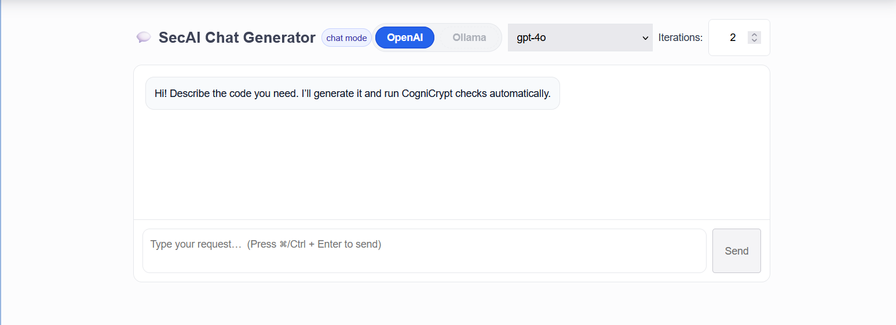
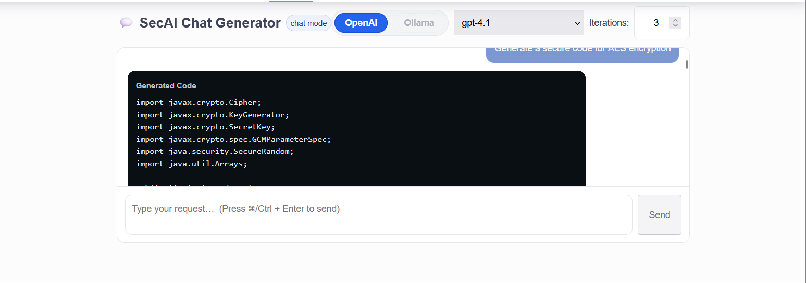
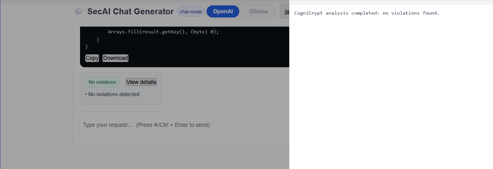

# **Code Generation**

## **1 Introduction**

Code Generation is a core feature of the SecAI plugin. Implementing cryptographic functionalities are a crucial task, but often it is tasked to developers with an insufficient security background to do so. Modern cryptographic APIs and security practices are complex and wide-ranging, and inexperience can lead to severe vulnerabilities in the codebase.

The Code Gen feature is designed to overcome this hurdle by allowing the user to provide a simple prompt to a large language model (LLM) which is then tasked with generating secure and usable Java code. To ensure the reliability of the output, the generated code is subsequently verified by CogniCrypt, a static analysis tool specifically focused on detecting cryptographic API misuses.

By utilizing an LLM and CogniCrypt in tandem, this feature creates an iterative feedback loop that produces validated, secure code. This provides developers with a reliable method to quickly and safely implement complex cryptographic operations without needing to be domain experts in the field.

***

## **2 Overview**

The Code Generation feature is presented through an intuitive user interface designed to streamline the creation of secure code. The interface allows users to provide natural language prompts and, in return, receive validated Java code accompanied by a detailed security analysis.

Before submitting a request, the user can configure the generation pipeline by selecting a Large Language Model (LLM) provider (OpenAI, Google Gemini, or self-hosted via Ollama), a specific model, and the number of iterations for the feedback loop. Once submitted, the system initiates a cycle where the LLM generates code, which is then automatically analyzed by CogniCrypt for security violations. This process repeats for the specified number of iterations. Upon completion, the user is presented with the final version of the generated code and a report detailing any persistent security issues.

***

## **3 Workflow**

The Code Generation feature operates on a multi-stage pipeline that begins with the user's prompt and ends with the delivery of validated Java code. The process consists of four key stages: initial code generation, verification, iterative improvement, and finalization. This section details the logical flow of each stage.

### 3.1 Initial Code Generation

After receiving the user prompt, the first stage of the pipeline is executed.

- Prompt Engineering:

    To guide the model toward a secure and compliant output from the very beginning, the system first reads the entire set of 51 CrySL (Cryptographic Specification Language) rules. This rule set is appended to the user's prompt, providing the LLM with the necessary security context.

- Invoking LLM:

    The enriched prompt is then sent to the appropriate LLM provider.

- Response Parsing:

    The LLM's response, which typically includes explanatory text and a code block, is parsed to extract the Java code.

### 3.2 Cognicrypt Analysis

The extracted code is sent to the static analysis tool (Cognicrypt) for analysis and verification. The generated .java file is compiled into a .class file, which is then packaged into a JAR for analysis. This JAR is provided to Cognicrypt, which checks for misuses of the Java Cryptographic Architecture (JCA) based on the CrySL rules and produces a detailed report

### 3.3 Iterative Improvements

If the CogniCrypt analysis identifies violations, the iterative feedback loop is initiated. The SARIF report is parsed to extract violation details. This information—including the flawed code, the specific CrySL rules violated, and detailed error descriptions—is then used to construct a new, comprehensive prompt. The model is instructed to fix the identified issues, and the cycle of generating, compiling, and analyzing the code is repeated until no violations are found or the user-defined iteration limit is reached. 

### 3.4 Finalization

The pipeline concludes when one of the exit conditions for the iterative loop is met.

- Successful Validation:

    If CogniCrypt reports no violations, the final, validated Java code is returned to the user with a success message appended as a comment

- Unsuccessful Validation:

    If the maximum number of iterations is reached and violations still persist, the last generated version of the code is returned. The final CogniCrypt report is appended as a block comment to make the user aware of remaining issues

***

## **4. Guide**

This section provides a step-by-step walkthrough on how to use the Code Generation feature within the SonarQube interface.

### 4.1 Accessing the Code Generation Interface

To begin, navigate to your project's main dashboard in SonarQube. On the top navigation bar, click on the SecAI tab. From the sidebar menu that appears, select Code Generation to open the main interface for generating and validating cryptographic code.

### 4.2 Configuring the Generation Pipeline

Before submitting a request, you can configure the generation pipeline to tailor the process to your needs. The following options are available at the top of the interface:

- LLM Provider: Choose the Large Language Model provider you wish to use. The available options are OpenAI (with API keys) and Ollama (self-hosted models)

- Model: Select a specific model from the chosen provider. The dropdown will populate with relevant models, such as gpt-4o.

- Iterations: Specify the maximum number of times the feedback loop should run. This controls how many attempts the system will make to fix any detected security violations.

### 4.3 Submitting a Prompt

In the main text area, enter a natural language prompt describing the cryptographic functionality you need. For the best results, be clear and specific in your request.

### 4.4 Reviewing the Results

After the pipeline completes its execution, the interface will display the results.

- Generated Code: The final version of the Java code will be presented in the code editor view.

- Analysis Report: A summary of the security analysis will be provided alongside the code. The outcome will be one of the following:

    1. Successful Validation: If CogniCrypt finds no security violations, a success message will be appended as a comment at the end of the generated code.

    2. Unsuccessful Validation: If violations still persist after the maximum number of iterations has been reached, the last generated version of the code will be returned. The final CogniCrypt report, detailing the remaining issues, will be appended as a block comment to make you aware of the unresolved security risks. 

***

## **5. Backend Architecture**

The Code Generation feature is implemented as a multi-component Java application. The architecture is designed to be modular, with a clear separation of concerns between the main pipeline orchestration, LLM interaction, code processing, and security analysis.

### 5.1 Main Pipeline Orchestration

The `codegenMain` class serves as the central orchestrator of the code generation workflow. The `runPipeline` [1] method executes the end-to-end process:

- Initialization: A temporary working directory is created to store the generated code, compiled classes, and analysis reports. Instances of `documentProcessor` and `cogniCryptRunner` are initialized. API keys are retrieved using `getEnvVariable` [2].

- LLM Selection: Based on the provider parameter (`openai`, or `ollama`), the appropriate LLM wrapper class is instantiated.

- Initial Code Generation: The selected LLM is invoked with the user's query and the full set of CrySL rules [4] to generate the initial Java code.

- Compilation and Analysis: The generated code is saved to a .java file [6], compiled into a .class file [11], packaged into a .jar file [12], and then analyzed by the CogniCrypt static analysis tool on the resulting JAR file [13].

- Iterative Refinement: If the CogniCrypt report [7] contains violations, the system enters a feedback loop:

    1. The report is processed to extract the violated CrySL rules and error descriptions [8, 9, 10].

    2. A new prompt is constructed, containing the previous code, the identified issues, and the relevant CrySL rule details.

    3. The LLM is invoked again to generate a corrected version of the code [3].

    4. This cycle of compilation, analysis, and refinement continues until no violations are detected or the maximum number of iterations is reached.

- Finalization and Cleanup: The final code and analysis results are returned. The temporary working directory and all its contents are deleted.

### 5.2 LLM Interaction

Interaction with the different LLM providers is abstracted into separate classes (`openai_LLM`, `ollama_LLM`), each implementing a common interface.

- `Generate` method [3]: Constructs the initial, detailed prompt containing the user's query and the full context of all 51 CrySL rules. This is designed to guide the LLM towards generating secure code from the outset.

- `GenerateIterations` method [3]: Constructs the prompt for the refinement loop. This prompt includes the previously generated code, the specific issues found by CogniCrypt, the raw CrySL rules that were violated, and detailed error descriptions. This provides the LLM with targeted feedback for fixing the identified vulnerabilities.

### 5.3 Code and Report Handling

`documentProcessor.java` is responsible for all file I/O and data processing tasks:

- `readAllCryslRules()` [4]: Reads the text versions of all 51 CrySL rules to provide context to the LLM during the initial generation phase.

- `splitGPTResponse()` [5]: Extracts the Java code from the LLM's response, stripping away any surrounding text or markdown formatting.

- `saveCodeToJava()` [6]: Saves the extracted code to a demo.java file in the temporary working directory.

- `processCCReport()` [7]: Parses the JSON output from CogniCrypt to identify and format any security violations.

- `cryslViolations()` [8] and `extractInfo()` [9]: Extract the specific rule IDs and error types from the processed report.

- `readCryslRules()` and `readErrorDescriptions()` [10]: Read the detailed information for the violated rules to provide rich context to the LLM during the iterative refinement process.

### 5.4 Cognicrypt Execution

The `cogniCryptRunner` class encapsulates the logic for running the external CogniCrypt analysis tool:

- `compileJavaFile()` [11]: Compiles the generated demo.java file. It includes a fallback to an external `javac` compiler if the SonarQube JVM is a JRE without a built-in compiler.

- `createJar()` [12]: Packages the compiled .class file into a demo.jar archive.

- `runCC()` [13]: Executes the CogniCrypt HeadlessJavaScanner as a separate process, passing the generated JAR file and the CrySL rules for analysis. It copies the necessary resources (`copyResource` & `copyResourceDir` [14]) into the temporary directory for the analysis run.

***

## **6. Example Walkthrough**

This section contains an example run of the Code Generation pipeline, along with relevant screenshots 

### 6.1 Configuration and Prompt Input

The initial view presents the pipeline configuration options. Here, the user can select the provider, model as well as number of iterations.

Once configured, the user enters a natural language prompt into the text input field, detailing the required cryptographic functionality. Clicking "Generate" initiates the pipeline.

### 6.2 Reviewing Generated Code

After the pipeline finishes execution, the user is presented with the final, generated Java code in an editor view. This interface provides standard controls to copy the code to the clipboard or download it as a .java file for immediate use.

### 6.3 Inspecting the Analysis Report

Alongside the code, the Analysis Result from CogniCrypt is displayed.

- In this example, the generated code has passed all security checks, and the tool reports that no violations were found.

- If the iterative process had been unable to resolve all issues within the iteration limit, this panel would instead display the detailed CogniCrypt report, outlining the remaining violations for the user to address manually.

***

## **7 API Key Setup Guide**

### **7.1 OpenAI API Key Configuration**

**Obtaining an OpenAI API Key**:
1. Visit the [OpenAI Platform](https://platform.openai.com/api-keys)
2. Sign up for an account or log in to your existing account
3. Navigate to the "API Keys" section in your dashboard
4. Click "Create new secret key"
5. Copy the generated API key (it starts with `sk-`)
6. **Important**: Store this key securely - you won't be able to see it again

**Pricing**: OpenAI operates on a pay-per-use model. Check current pricing at [OpenAI Pricing](https://openai.com/pricing).

### **7.2 Google Gemini API Key Configuration**

**Obtaining a Google Gemini API Key**:
1. Visit [Google AI Studio](https://makersuite.google.com/app/apikey)
2. Sign in with your Google account
3. Click "Create API Key"
4. Select an existing Google Cloud project or create a new one
5. Copy the generated API key
6. **Important**: Keep this key secure and never share it publicly

**Free Tier Benefits**:
- **Free API access** up to generous monthly limits
- No credit card required for basic usage
- Excellent for development, testing, and small-scale production use
- Check current limits at [Google AI Pricing](https://ai.google.dev/pricing)

***

## **Code references**

**`codegenMain.java`**

- `runPipeline`: Orchestrates the entire workflow from initialization to cleanup. [1]

- `getEnvVariable`: Retrieves API keys from environment variables. [2]

**`openAI_LLM.java`, `ollama_LLM.java`** 

- `Generate`: Constructs the prompt for the initial code generation, including the user query and all CrySL rules. [3]

- `GenerateIterations`: Constructs the prompt for the feedback loop, including the previous code and specific error details. [3]

**`documentProcessor.java`**

- `readAllCryslRules`: Reads the full set of CrySL rules from resources. [4]

- `splitGPTResponse`: Extracts the Java code block from the LLM's raw output. [5]

- `saveCodeToJava`: Writes the generated code to a demo.java file. [6]

- `processCCReport`: Parses the JSON report from CogniCrypt into a human-readable format. [7]

- `cryslViolations`: Extracts violated rule names from the processed report string. [8]

- `extractInfo`: Extracts specific "Rule - ErrorType" combinations from the raw JSON report. [9]

- `readCryslRules` & `readErrorDescriptions`: Read the full text of violated rules and their descriptions from resources. [10]

**`cogniCryptRunner.java`**

- `compileJavaFile`: Compiles the demo.java source file, with a fallback to an external javac. [11]

- `createJar`: Packages the compiled .class file into a demo.jar. [12]

- `runCC`: Executes the CogniCrypt static analysis tool as an external process. [13]

- `copyResource` & `copyResourceDir`: Helper methods to copy the scanner and rules from the plugin's resources to the temporary directory. [14]

***