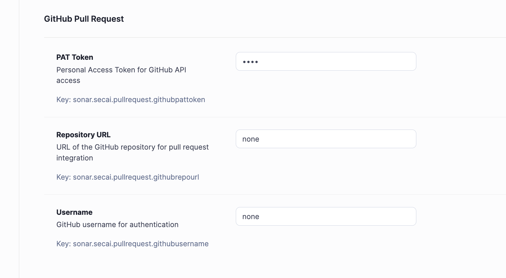

# GitHub Pull Request Integration

## Overview

The SecAI SonarQube plugin includes GitHub integration that allows users to automatically create pull requests with AI-generated code fixes directly from the plugin interface. This feature is available in both the AI Fix and Quick Fix components.

---

## Setup and Configuration

### 1. Sonarqube settings Variables

Configure the following variables in your SonarQube instance under project settings:

```bash
# GitHub Configuration
GITHUB_TOKEN=your_github_personal_access_token
GITHUB_OWNER=your_github_username_or_organization
GITHUB_REPO=your_repository_name
```

### 2. GitHub Personal Access Token Setup

1. Go to GitHub Settings → Developer settings → Personal access tokens → Tokens (classic)
2. Click "Generate new token (classic)"
3. Select the following scopes:
   - `repo` (Full control of private repositories)
   - `workflow` (Update GitHub Action workflows)
4. Copy the generated token and add it to your SonarQube settings



---

## Usage

### AI Fix Component

1. Navigate to an issue in the SecAI plugin
2. Go to the "AI Fix" tab
3. Click "Generate the fix" to get AI-generated code
4. Click "Create GitHub PR" to automatically create a pull request
5. Review the generated fix in the "Diff View" [here](diff-view.md) tab

### Quick Fix Component

1. Select an issue from the issue list
2. Go to the "Quick Fix" tab
3. Choose from available quick fix options
4. Click "Apply Quick Fix & Create PR" to apply the fix and create a pull request

---

## Technical Implementation

### Core Components

#### GitHub API Integration
Both components use the Octokit library for GitHub API interactions:

```javascript
import { Octokit } from "@octokit/rest";

const octokit = new Octokit({
    auth: GITHUB_TOKEN,
});
```

#### Pull Request Creation Flow

1. **Branch Creation**: Creates a new branch with a unique name based on the issue
2. **File Update**: Updates the target file with the fixed code
3. **Pull Request**: Creates a PR with descriptive title and body
4. **User Feedback**: Displays success message with PR link

### API Endpoints Used

- `GET /repos/{owner}/{repo}/contents/{path}` - Fetch file content
- `PUT /repos/{owner}/{repo}/contents/{path}` - Update file content
- `POST /repos/{owner}/{repo}/pulls` - Create pull request

---

## Error Handling

The integration includes comprehensive error handling for:

- **Authentication Issues**: Invalid or expired GitHub tokens
- **Repository Access**: Insufficient permissions or non-existent repositories
- **File Operations**: File not found or merge conflicts
- **Network Issues**: API rate limits or connectivity problems

Common error messages:
- "GitHub token not configured"
- "Repository not found or access denied"
- "File not found in repository"
- "Failed to create pull request"

---

## Security Considerations

1. **Token Security**: Store GitHub tokens securely and never commit them to version control
2. **Permissions**: Use tokens with minimal required permissions
3. **Repository Access**: Ensure the token has access only to intended repositories
4. **Environment Isolation**: Use different tokens for development and production environments

---

## Troubleshooting

### Common Issues

**Issue**: "GitHub token not configured"

- **Solution**: Verify the `GITHUB_TOKEN` environment variable is set correctly

**Issue**: "Repository not found"

- **Solution**: Check `GITHUB_OWNER` and `GITHUB_REPO` values match your repository

**Issue**: "Insufficient permissions"

- **Solution**: Ensure your GitHub token has `repo` scope permissions

**Issue**: Pull request creation fails

- **Solution**: Verify the target branch exists and you have write access to the repository