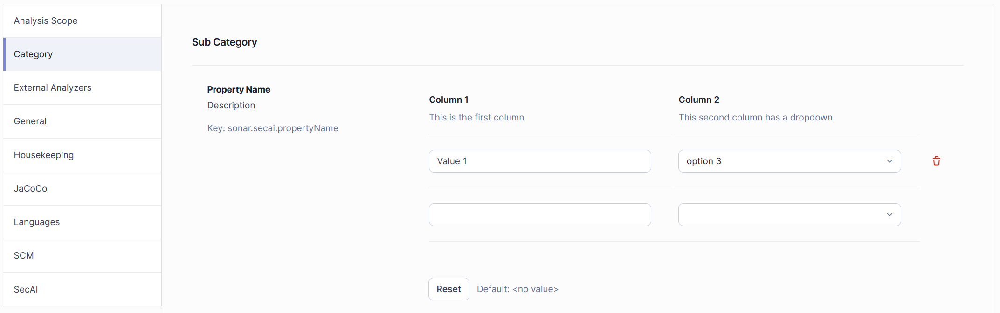

# Creating Custom SonarQube Properties

This guide contains [general information](#general) about [SonarQube](https://www.sonarsource.com/products/sonarqube/) properties, an [example](#example) to get started, and important instructions to follow in order to [make your custom properties available in SonarQube](#adding-the-properties-to-sonarqube) and how to [access the properties](#accessing-custom-properties).

---

## General

SonarQube properties, or [analysis parameters](https://docs.sonarsource.com/sonarqube-server/analyzing-source-code/analysis-parameters), consist of multiple different components and can be set when running the analysis command, with configuration files in the user's project or in the settings of the SonarQube web interface. The ones set through the UI are the only ones stored in the SonarQube server database. Before that, however, they must be defined within the plugin code.

### Key

Each property needs to have a unique key. It is recommended to prefix the key with `sonar.` and the plugin name, for example `sonar.secai.tools`. Sonar property keys are case-sensitive.

### Property Types

There are different types of properties that can be created:

* `STRING`: Basic single line input field
* `TEXT`: Multiple line text-area
* `PASSWORD`: Variation of `STRING` with masked characters
* `BOOLEAN`: True/False
* `INTEGER`: Integer value, positive or negative
* `FLOAT`: Floating point number
* `REGULAR_EXPRESSION`: Regular expression
* `USER_LOGIN`: User login
* `JSON`: Multiple line text-area to enter JSON content. This does not allow multiple values.
* `FORMATTED_TEXT`: Custom formatted text type
* `EMAIL`: Email address
* `SINGLE_SELECT_LIST`: Single select list with a list of options. This list is passed through the `.options(String...)` method. Selecting multiple values is possible, though SonarQube simply offers the user additional dropdowns whenever a value is selected. This means that the property can return duplicate entries.
* `PROPERTY_SET`: Property set instance. This always permits multiple values.

While most of the above types are fairly self-explanatory and can be created by following the [example below](#example) the property type `PROPERTY_SET` is a little more complicated. Here, each entry is a set of values.



This is done by calling the `.fields` method on the `PropertyDefinition` builder. As you can see in the following code example `PropertyFields` are created just like regular properties, except the methods called below are the only ones available. It is not possible to set a default value for a `PROPERTY_SET` or individual property fields.

```java
    .fields(
            PropertyFieldDefinition.build("col1")
                    .type(PropertyType.STRING)
                    .name("Column 1")
                    .description("This is the first column")
                    .build(),
            PropertyFieldDefinition.build("col2")
                    .type(PropertyType.SINGLE_SELECT_LIST)
                    .options("option 1", "option 2", "option 3")
                    .name("Column 2")
                    .description("This second column has a dropdown")
                    .build()
    )
```

### Categories

Properties are sorted into different categories. In the image above you can see the lexicographically sorted list of categories on the left. By default, the category is set to the plugin name. You can also add to existing categories instead of making a new one.

It is also possible to specify a sub-category, though, by default, this is the same as the category.

### Qualifiers/Config Scopes

Settings can be accessed in multiple locations in SonarQube's UI. By default, a property can only be accessed in the general settings of the server. However, with the method `.onQualifiers` additional scopes can be added. If the property should not be accessed through the general settings, use `.onlyOnQualifiers` instead to restrict visibility. Starting with version 10.13 SonarQube will be using `ConfigScope` instead of `Qualifiers` and the available locations are reduced to the following:

* `PROJECT`
* `VIEW`
* `SUB_VIEW`
* `APP`

Though `Qualifiers` offers more than the above four options, it is recommended not to use soon to be deprecated values of `Qualifiers`.

### Order

The selectable list of main categories is lexicographically sorted and when clicking on a category the sub categories are sorted lexicographically too. However, while the settings within a sub category are also sorted lexicographically by default, you can use the `index` method to change the order, though properties with the same index will still be sorted lexicographically. This only applies **inside** the sub category and cannot be used to order the sub categories themselves.

---

## Example

Here you can see an example properties file. If you wish to add to an existing file instead, copy the method `propertyName` and add a call to it to the `getProperties` method.

```java
package org.sonarsource.plugins.secai.settings;

import org.sonar.api.PropertyType;
import org.sonar.api.config.PropertyDefinition;
import org.sonar.api.resources.Qualifiers;

import java.util.ArrayList;
import java.util.List;

import static java.util.Arrays.asList;

public class NewToolProperties {
    
    private static NewToolProperties() {
        // only statics
    }

    public static List<PropertyDefinition> getProperties() {
        return asList(
                propertyName()
        );
    }

    private static PropertyDefinition propertyName() {
        final String KEY = "sonar.secai.propertyName";
        
        // It's best to always add a default options whenever possible. When passing it to the property builder it has to be String
        final String DEFAULT_VALUE = "default value";
        
        // For dropdown lists you have to add options to populate the list. This method is static so any option lists must be static too. The enum class used here is implemented below.
        List<String> options = new ArrayList<>();
        for (OptionsEnum value: OptionsEnum.values()){
            options.add(value.getDisplayString());
        }
        return PropertyDefinition.builder(KEY)
                // Set the default value
                .defaultValue(DEFAULT_VALUE)
                
                // Set the property type and, in this case, add options
                .type(PropertyType.SINGLE_SELECT_LIST)
                .options(options)
                
                // You can decide if the user can select/enter multiple values
                .multiValues(true)
                
                // Informational data
                .name("Property Name")
                .description("<description>")
                
                // Location within the settings menu
                .category("Category")
                .subCategory("Sub Category")
                
                // Where should the property be accessible?
                .onQualifiers(Qualifiers.PROJECT)
                
                // Alternatively, if you want your property to be hidden (in this case do not use qualifiers) you can add 
                //.hidden()
                
                .build();
    }
}
```

```java
package org.sonarsource.plugins.secai.analysis.newtool;

public enum OptionsEnum {
    BORING_ENUM_OPTION ("But *fancy* String to /display/ in SonarQube!!"),
    THIS_is_very_LIMITED ("But we can have ~fun~ with the string");

    private final String displayString;

    OptionsEnum(String displayString) {
        this.displayString = displayString;
    }

    public String getDisplayString() {
        return displayString;
    }
}
```

---

## Adding the Properties to SonarQube

Within `SecAIPlugin.java` [(link)](../../SonarQubePlugin/src/main/java/org/sonarsource/plugins/secai/SecAIPlugin.java) add this new property file using `context.addExtensions(NewToolProperties.getProperties());`. Make sure that the method is `addExtensions` (plural) and not `addExtension` (singular) and that the call to `NewToolProperties.getProperties()` is the only argument. If this is done incorrectly your new properties will not show in SonarQube.

---

## Accessing Custom Properties

When working within a `Sensor` you can access the `Configuration` through the `SensorContext`. Then you can retrieve your custom properties through getters using your unique property key.

If you need to access your settings when responding to an API call, you can use the code below.

```java
    WsClient wsClient = WsClientFactories.getLocal().newClient(request.localConnector());
    Settings.ValuesWsResponse valuesWsResponse = wsClient.settings()
            .values(new ValuesRequest()
                    .setComponent(projectKey)
                    .setKeys(List.of("sonar.secai.propertyName", "sonar.secai.secondProperty"))
            );
```

However, for the property type `PROPERTY_SET` using the key alone returns a `String` array of indices and no actual values. For a set called `sonar.property.set` you need to access `sonar.property.set.1.col1` to retrieve the entry of the field `col1` in the entry set with index 1 and `sonar.property.set.2.col1` to retrieve the entry in the second entry set. This goes on for all fields and indices.

After being initialized with a `Configuration` or `Request` object, the `SecAISettings` are available as a singleton. If wish to use this to access your custom settings, make sure to set your new properties in both constructors and create appropriate fields and getters.

---

*For additional support or feature requests, please refer to the [Contributing Guide](../contributing.md) or create an issue in the project repository.*