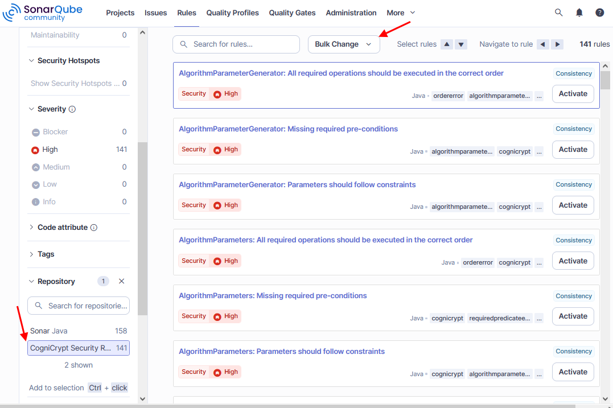
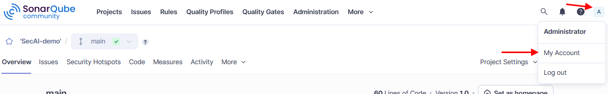
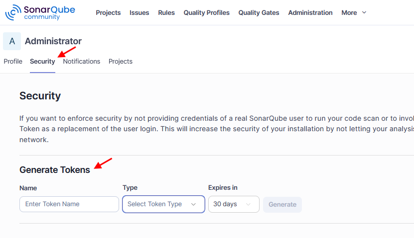

# First SonarQube Analysis

This guide explains how to set up and execute the *SecAI* analysis in SonarQube. It may be helpful to skim this even if you have used SonarQube before, to ensure that you do not miss a step.

To try out these first steps you can use the demo project [**SecAI-demo**](https://github.com/secure-software-engineering/CogniCryptSQPlugin/blob/main/SecAI-demo.zip) from our GitHub.

---

## Verify Installation

The plugin will only be detected by the server after a restart of the SonarQube instance. Then an administrator account can verify its presence under **Administration > Marketplace > Plugins > Installed**.

> **Note:** On a newly installed SonarQube server the default credentials are username *admin* and password *admin*. You will immediately be prompted to change the password.

The web interface can be accessed through `http://localhost:9000` in a local setup, or using `http://\<ip address>:9000` if it is running on another machine. 

---

## Create SonarQube Project

In order to analyze code you will need to create a new SonarQube project to receive the analysis results. If you are intending to re-analyze an existing SonarQube project you can skip this step.

On your homepage (or under the **Projects** tab) in the top right you can click **Create Project**. Please select **Local Project** and finish the setup dialog. You can also use **Import from DevOps Platform**, however, if you only wish to test the setup this option may be unsuitable as it requires far more steps.

---

## Activate SecAI Rules

The plugin will only be executed when at least one SonarQube rule from the `CogniCrypt Security Rules` repository is activated in the active quality profile (**Project Settings > Quality Profiles**) of the project.

You can choose to use the integrated `SecAI` quality profile, which contains all `CogniCrypt Security Rules` but no others. Or, you can extend an existing profile such as the default `Sonar way` profiles. For this, go to the **Quality Profiles** menu at the very top of the page. As you can see below, you then click on the three dots of the `Sonar way` profile for **Java** and select **Extend**. You will be prompted to give the new profile a name.


If you already have a custom profile you can simply click on that instead. Both options should lead to the below page, where in the bottom right you can opt to **Activate More** rules.


You will be shown all rules not yet activated in your profile. On the left you can filter the rules by repository to narrow down the amount. If you wish to activate all at once you can use the **Bulk Change** option at the top. You can also filter the results more using tags and CWEs.



The final step is to activate your new profile for your project using **Project Settings > Quality Profiles** or by going back to the previous page and selecting your projects under **Change Projects**.

---

## Analysis Token

If this is your first time analyzing your project you will need to generate an analysis token. To do this, log into an administrator account. Click on the account icon in the top right and select **My Account**.



Switch to the **Security** tab. Here, you can generate tokens.



You can generate a **Project Analysis Token** which will only work for the specified project or a **Global Analysis Token** which will work on all projects. Copy the token immediately and store it securely. You will not be able to view the token value at a later time.

---

## Run Analysis

For running our *SecAI* analysis only local analysis has been properly tested. However, it is confirmed that using the [*SonarQube for IDE* plugin](https://www.sonarsource.com/products/sonarqube/ide/) is not possible.

In order to execute the local analysis open a console in the root directory of your project. Which command to use depends on the build system you use. You will also need the `project key`, `project name`, and the [`analysis token`](#analysis-token). If your SonarQube instance is not running on `localhost` you will also need to replace the `host url`.

> Note: The `project key` can be found under **Project Information > About this Project**.

After the analysis is done the results will show in SonarQube's web view.

### Potential Issues

Other than the quality profile settings mentioned [above](#activate-secai-rules), there are a few more potential, but **uncommon** issues that could interfere with the analysis. These can be prevented by adjusting the plugin settings, which can be found within your project under **Project Settings > General Settings > SecAI**.

During the analysis *SecAI* will attempt to build a Jar of your project as *CogniCrypt<sub>SAST</sub>* does not analyze uncompiled source code. This means that your project must use either Maven of Gradle as a build tool. The plugin tries to determine which build system to use based on the build files at top-level in your project folder. In most cases this should work automatically, however, in case both a `pom.xml` and `build.gradle(.kts)` are present you may have to manually specify which one to use. The relevant setting is called *Build System*.

Another potential issue could arise if the plugin is unable to locate your Maven installation. In that case you can simply add your path to *Maven Home* in the settings. These settings are project-wide and not user-specific, but you can add multiple paths. However, this is not a frequent issue, so we recommend trying it out first to see if the installation is found automatically.

### Analyzing a Maven Project

For a Maven project use the following command and replace `<projectKey>`, `<projectName>` and `<token>` with the correct values associated with your SonarQube project.

```bash
mvn clean verify org.sonarsource.scanner.maven:sonar-maven-plugin:sonar -Dsonar.projectKey=<projectKey> -Dsonar.projectName='<projectName>' -Dsonar.host.url=http://localhost:9000 -Dsonar.token=<token>
  ```

### Analyzing a Gradle Project

For a Gradle project use the following command and replace `<projectKey>`, `<projectName>` and `<token>` with the correct values associated with your SonarQube project.

```bash
./gradlew sonar -Dsonar.projectKey=<projectKey> -Dsonar.projectName='<projectName>' -Dsonar.host.url=http://localhost:9000 -Dsonar.token=<token>
  ```

> **Note:** On Windows you may have to use `.\gradlew` instead of `./gradlew`.

You will also need to add a reference to SonarQube in your `build.gradle` or `build.gradle.kts` file:

```groovy
plugins {
  id "org.sonarqube" version "7.2.2.6593"
}
```

---

## View Analysis Results

After running the analysis the results are automatically uploaded to your SonarQube server. You can now view them in the web interface. 

If you have used the project **SecAI-demo** to try out the analysis and activated all *SecAI* rules, there should be 11 detected issues tagged `cognicrypt`.

For an introduction to the *SecAI* specific features you can consult the [user guide](../user-guide/overview.md).