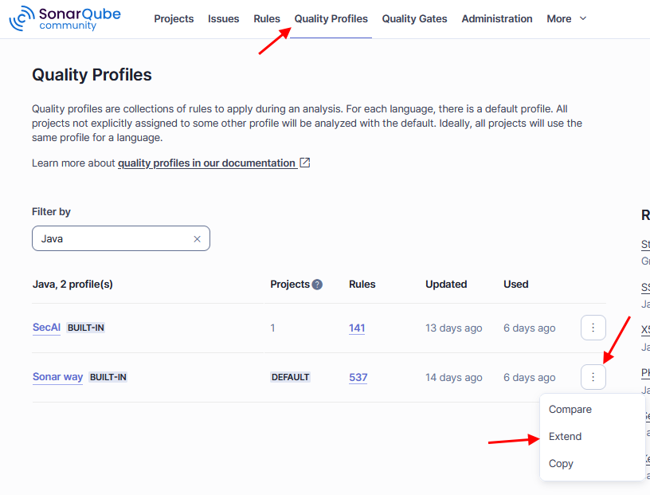
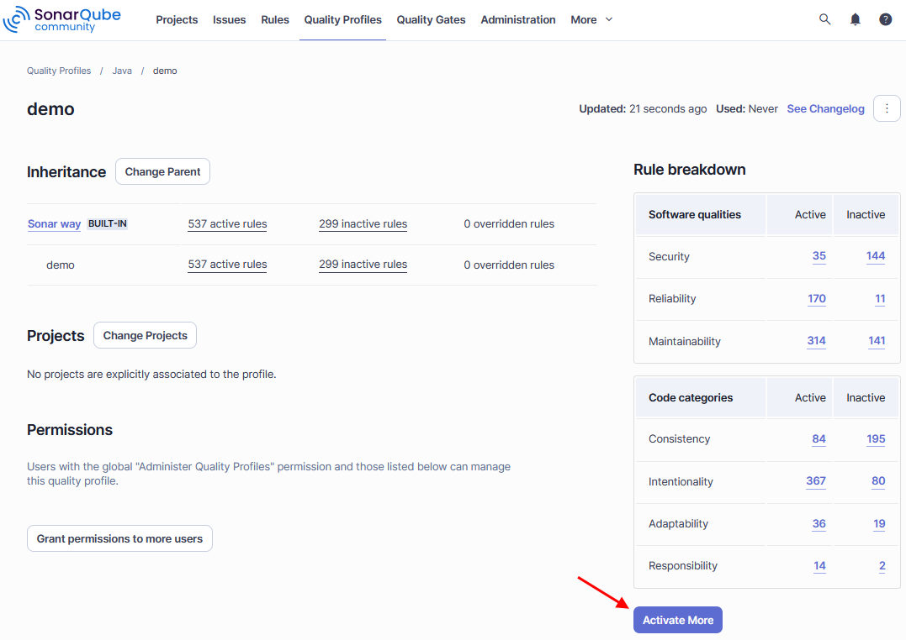

# First SonarQube Analysis

---

## Verify Installation

The plugin will only be detected by the server after a restart of the SonarQube instance. Then an administrator account can verify its presence under **Administration > Marketplace > Plugins > Installed**.

> **Note:** On a newly installed SonarQube server the default credentials are username *admin* and password *admin*. You will immediately be prompted to change the password.

---

## Activate SecAI Rules

The plugin will only be executed when at least one SonarQube rule from the `CogniCrypt Security Rules` repository is activated in the active quality profile (**Project Settings > Quality Profiles**) of the project.

You can choose to use the integrated `SecAI` quality profile, which contains all `CogniCrypt Security Rules` but no others. Or, you can extend an existing profile such as the default `Sonar way` profiles. For this, go to the **Quality Profiles** menu at the very top of the page. As you can see below, you then click on the three dots of the `Sonar way` profile for **Java** and select **Extend**. You will be prompted to give the new profile a name.

If you already have a custom profile you can simply click on that instead. Both options should lead to the below page, where in the bottom right you can opt to **Activate More** rules.

You will be shown all rules not yet activated in your profile. On the left you can filter the rules by repository to narrow down the amount. If you wish to activate all at once you can use the **Bulk Change** option at the top. You can also filter the results more using tags and CWEs.

The final step is to activate your new profile for your project using **Project Settings > Quality Profiles** or by going back to the previous page and selecting your projects under **Change Projects**.

---

## Run Analysis

TODO

