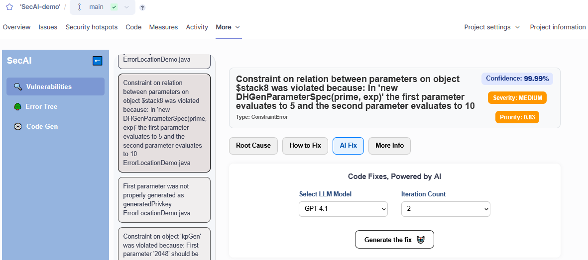
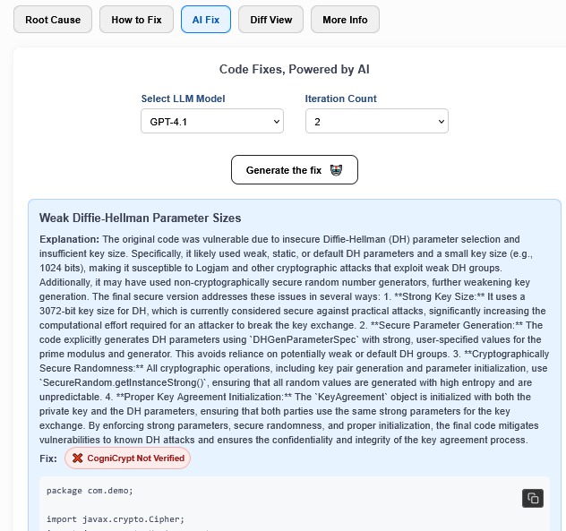
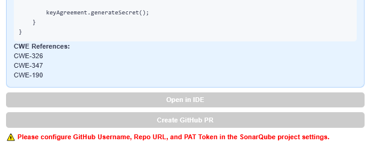
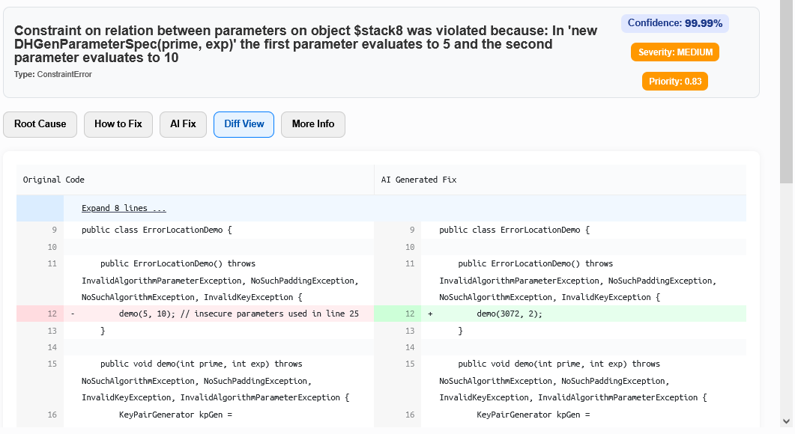

# AIFix

This feature can be accessed through the custom *SecAI* web pages. If you are unsure how to reach this part of the interface, refer to the [this overview](overview.md#custom-web-pages-within-sonarqube).

More specifically, you can find the *AIFix* feature by selecting the **AIFix** tab when viewing an issue in the [vulnerabilities list](./vulnerabilities-list.md) or by clicking an error node in the [error tree](error-tree.md).

At the top you can select which model to use. Also, similar to [*Code Generation*](code-gen.md), a *CogniCryptSAST* analysis is run on the generated code to check for unresolved issues. If you increase the number of iterations the AI will attempt to fix persisting issues before returning a result.

The result includes an explanation, the code fix and *CWE* mappings. You will also be able to whether or not the code passed the final *CogniCryptSAST* analysis.

At the bottom, you can also choose to generate a GitHub pull request for this fix. For more details see [here](./github-pr-integration.md)

A diff view comparing the proposed changes to the original code can viewed in the newly created **Diff View** tab in the detailed error view, or, if you used the shortcut from the error tree ...

---

## Common Issues

### AIFix returns *Unexpected Error*

In the `Flaskapp` folder of your backend there is a log file called `aifix.log`. This may provide additional insight into the problem. Furthermore, the file `app.log` logs all http requests received and sent by the flask server.
