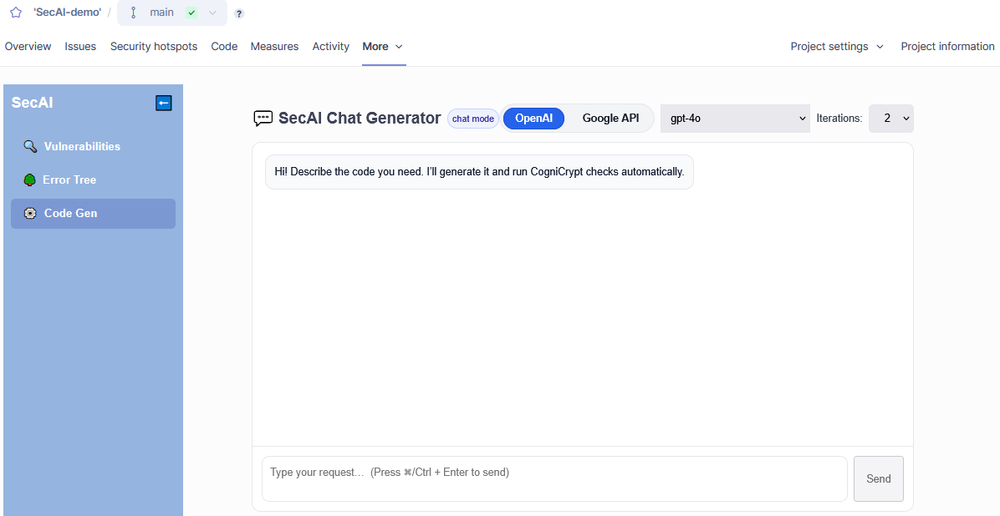
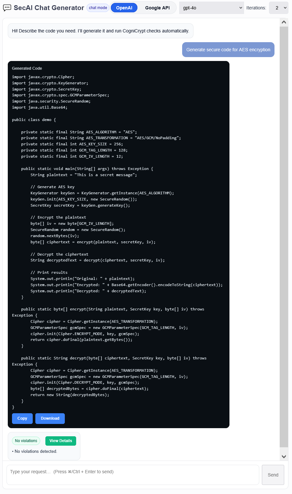
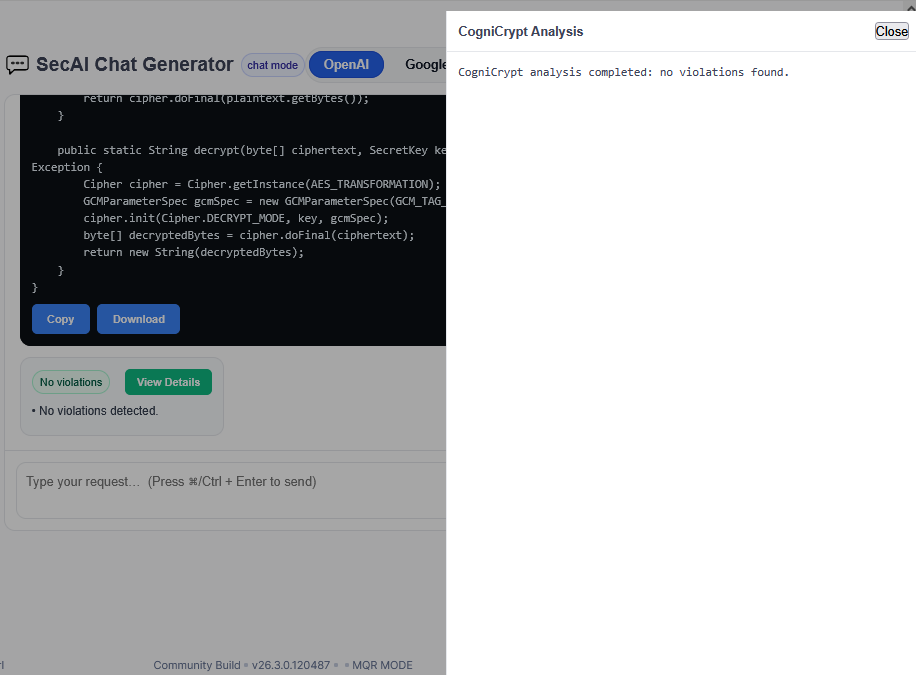

# Code Generation

This feature can be accessed through the third tab inside the custom *SecAI* web pages. If you are unsure how to reach this part of the interface, refer to the [this overview](overview.md).

At the top you can select which model to use. Also, similar to [*AIFix*](aifix.md), a *CogniCryptSAST* analysis is run on the generated code to check for unresolved issues. If you increase the number of iterations the AI will attempt to fix persisting issues before returning a result. The screenshots below show the results of the prompt *"Generate secure code for AES encryption"*.

Open **View Details** for the detailed results of the final *CogniCryptSAST* analysis. If issues remain unresolved they will be displayed here, however, in this case no violations were detected.

