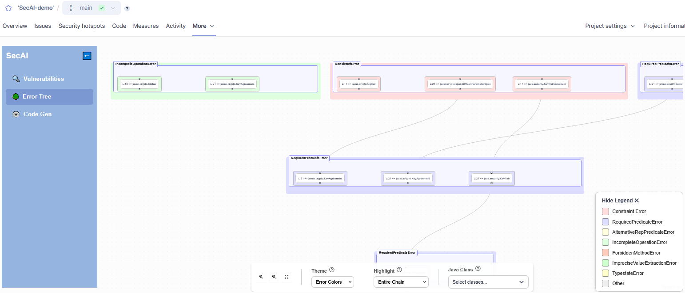
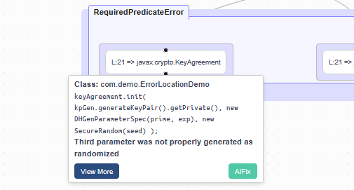
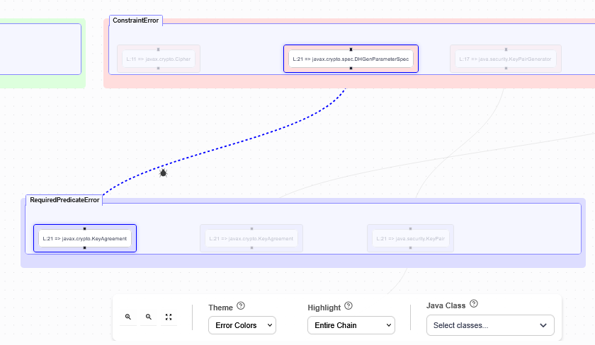
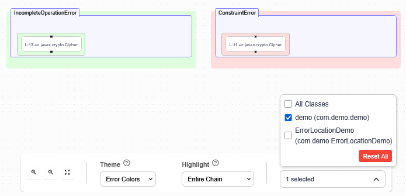

# Error Tree

This feature can be accessed through the second tab inside the custom *SecAI* web pages. If you are unsure how to reach this part of the interface, refer to the [this overview](overview.md#custom-web-pages-within-sonarqube).

The error tree shows how different issues are connected.

On each level of the tree errors of the same type are grouped together in one large node titled with the error type. The legend in the bottom right provides an overview mapping the node colors to the different error types. Each node inside the group nodes represents an issue and is labeled with the violating line and which part of the Java Cryptography Architecture (JCA) was misused. 

Hovering over a node will open a tooltip with additional information, namely the class containing the error, the code snippet, and the error message. **View More** opens the detailed error view described [here](./vulnerabilities-list.md) and **AIFix** opens the interface to generate an [*AIFix*](./aifix.md).

The nodes at the top level cause the errors on the lower levels. This means that by solving the root errors the connected errors tend to be resolved automatically. Clicking on a node highlights the connected errors and the path. By default the entire error chain is highlighted. Using the **Highlight** configuration options at the bottom you can change this to only ancestors or descendants.

Depending on the number of errors the entire tree may not be visible. To go up, down, left, or right click the background and drag the mouse to move. You can use the mouse wheel to zoom in and out or use the zoom buttons at the bottom of the page. There is also a button to fit the tree to the window.

You can also restrict the error tree to only showing errors in selected classes, though you are only able to select classes that contain errors.

