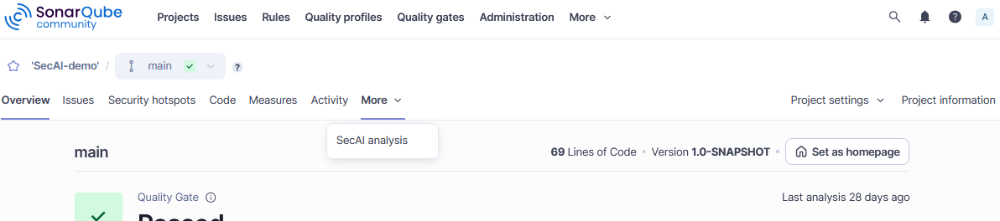

# Working with *SecAI*

The *SecAI* plugin integrates the SAST tool *CogniCryptSAST* and, additionally, offers features such as *Error Trees*, *Confidence Scores*, *AIFixes*, and *Code Generation*. 

Some of the features are integrated into the native SonarQube interface. However, the majority can only be accessed through custom web pages. This guide aims to introduce all features and where to find them.

To follow along you can download the demo project [`SecAI-demo.zip`](../../SecAI-demo.zip) from our GitHub. This is same project that is used for the screenshots in this guide. 
> **IMPORTANT:** Make sure to run the [first analysis](../getting-started/first-analysis.md) beforehand using the *SecAI* quality profile, as issues detected directly by the *SecAI* plugin are needed.

---

## The Native SonarQube Issue Interface

The native SonarQube interface is simply what you see when you open SonarQube's web interface in a browser. If you click on your project and open the **Issues** tab you will find a list of all detected issues.

---

## Custom Web Pages Within SonarQube

Not all information and features could be integrated in the native SonarQube interface. Therefore, a custom web page was added to the SonarQube interface. It can be accessed in each project under the **More** tab and is called *SecAI analysis*.

It opens to the vulnerabilities list.(feature list) more info [here](vulnerabilies-list.md)

However, there two more tabs. As the names imply, the [*Error Tree*](error-tree.md) displays the connections between different errors and [*Code Gen*](./code-gen.md) offers code generation for 