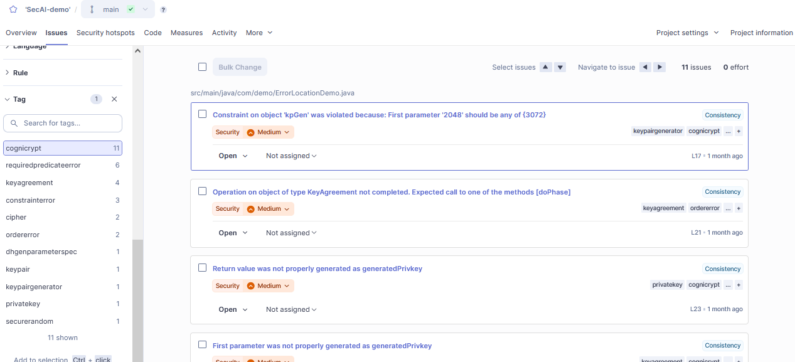
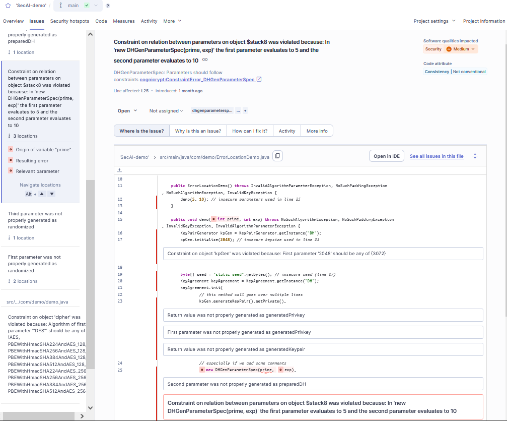
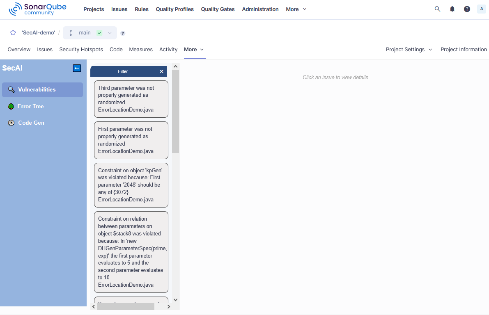

# Working with *SecAI*

The *SecAI* plugin integrates the SAST tool *CogniCryptSAST* and, additionally, offers features such as *Error Trees*, *Confidence Scores*, *AIFixes*, and *Code Generation*. 

Some of the features are integrated into the native SonarQube interface. However, the majority can only be accessed through custom web pages. This guide aims to introduce all features and where to find them.

To follow along you can download the demo project [`SecAI-demo.zip`](../../SecAI-demo.zip) from our GitHub. This is same project that is used for the screenshots in this guide. 
> **IMPORTANT:** Make sure to run the [first analysis](../getting-started/first-analysis.md) beforehand using the *SecAI* quality profile, as issues detected directly by the *SecAI* plugin are needed.

---

## The Native SonarQube Issue Interface

The native SonarQube interface is simply what you see when you open SonarQube's web interface in a browser. If you click on your project and open the **Issues** tab you will find a list of all detected issues.

Here, you can filter the issues based on different aspects, such as CWEs, severity, or tags. Currently, the only SAST tool integrated into *SecAI* is *CogniCryptSAST*, which means that all issues detected by the plugin will be tagged `cognicrypt`.

By selecting an issue you can open a detailed view of the error. At the top there is the error message and the severity. The tabs below that allow you to switch between a code snippet which shows the error location highlighted and in relation to other errors, tabs to further explain the issue and how to fix it, an activity tab to show the issue history, and a final tab with references for more info. On the left side is the list of issues to allow you to navigate to different issues but also additional locations relating to the current error.

---

## Custom Web Pages Within SonarQube

Not all information and features could be integrated in the native SonarQube interface. Therefore, a custom web page was added to the SonarQube interface. It can be accessed in each project under the **More** tab and is called *SecAI analysis*.

> **Note:** Sometimes the first attempt at opening the page fails with the error message `Page extension failed`. In this case simply try again.

The custom page opens to a vulnerabilities list similar to the issue list of the native SonarQube interface. However, this list only includes the issues detected by *CogniCryptSAST*. From this list you can open a detail view for each issue which includes [*Confidence Scores* and *Quick Fixes*](vulnerabilities-list.md) as well as access to the [*AIFix*](./aifix.md) feature.

However, there two more tabs. As the names imply, the [*Error Tree*](error-tree.md) displays the connections between different errors and [*Code Gen*](./code-gen.md) offers code generation using LLMs which is then verified using the integrated analysis tool *CogniCryptSAST*.

