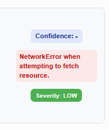

# Confidence Scores and Quick Fixes

The custom page opens to a vulnerabilities list similar to the issue list of the native SonarQube interface. However, this list only includes the issues detected by *CogniCryptSAST*. When first opening this page it can take a little while for the issues to show as the confidence scores are calculated before any issues are shown. However, as the scores, once calculated, are saved in the backend loading issues will be much faster the next time the page is accessed. 

Once the list of issues is populated you can open a [detail view](#detailed-issue-information) for each issue which includes [*Confidence Scores*](#confidence-severity-and-priority-scores) and [*Quick Fixes*](#quick-fixes) as well as access to the [*AIFix*](./aifix.md) feature. The list itself contains the error messages and file names.

## Detailed Issue Information

The header of the detail view contains the error message, the error type right below the message, and three scores which are explained [below](#confidence-severity-and-priority-scores). Underneath the header there are tabs to switch between different sections of the detail view: **Root Cause**, **How to Fix**, [**Quick Fix**](#quick-fixes), **AIFix** (see [here](./aifix.md)), and **More Info**.

The initial tab is **Root Cause** which contains a highlighted code snippet and a general description of the error type. The tab **How to Fix** instead explains the CrySL rule that the SonarQube rule was [based on](../cognicrypt/cc-rules.md). However, as these descriptions are static the dynamically generated error message above tends to contain the most relevant information.

Under the **More Info** tab you can find additional information, such as CWE references and a link to the relevant official Java documentation. This tab also lists the number of preceding and subsequent issues, though the [*error tree*](./error-tree.md) provides a much better overview.

### Confidence, Severity, and Priority Scores

In the top right you can see three scores. 

The first is the *Confidence Score*, signifying how confident the plugin is that this issue is a true positive. Therefore, a low percentage means that an issue can likely be ignored while actual issues will have a high percentage. Details on how this score is calculated can be found [here](../cognicrypt/false-positive-detection.md).

The second score is the *Severity*, with potential values *INFO*, *LOW*, *MEDIUM*, and *HIGH*. The SonarQube serverity of *BLOCKER* was not used. This score is assigned based on the error type and the violated rule, though, unfortunately the mapping is [incomplete](../cognicrypt/severity.md) and occasionally defaults to *MEDIUM*.

Out of the previous two scores a *Priority Score* is calculated to give the user an indication which issues should be prioritized. A weighting function $ \lambda = \lambda_1 + \lambda_2$ is applied  with $\lambda = 1$ to ensure that the combination of *Confidence* and *Severity Score* stays in the boundaries $[0,1]$. The priority score is then calculated as $p = \lambda_1 c + \lambda_2s$. The default weights ($\lambda_1$, $\lambda_2$) are set to $0.5$, ensuring that both scores contribute equally to the priority score. *Severity* levels are encoded as follows:$$INFO = 0.1,~ LOW = 0.33,~MEDIUM=0.66,~and~HIGH=1$$

### Quick Fixes

For some error types we offer pre-computed *Quick Fixes*. If there are no quick fixes available for an issue then the tab will be listed.

Here, you can choose one of the suggested secure values and copy the edited line into your project at the given location. It is also possible to use our [GitHub PR](./github-pr-integration.md) integration.

---

## Common Issues

### No issues found

- Make sure that at least one rule from the **CogniCrypt Security Rules** repository is active in your projects quality profile. See [first analysis steps](../getting-started/first-analysis.md)
- This interface only considers issues detected by *CogniCryptSAST*. Go to the **Issues** tab of your SonarQube project and filter for issues tagged `cognicrypt`. If there are no issues then there truly are no issues to display

### Confidence Score missing

- Network error: Make sure the flask backend is running and reachable
- No CPG available: open an issue in GitHub. This may be an actual issue

In the `Flaskapp` folder of your backend there is a log file called `fp.log`. This may provide additional insight into the problem. Furthermore, the file `app.log` logs all http requests received and sent by the flask server.